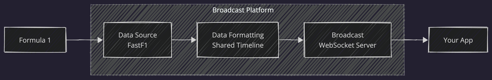

# Open Pit Wall 📡🏎️



Open Pit Wall is a Python project for replaying previously recorded Formula 1 timing and telemetry data as a simulated live WebSocket broadcast. It is designed for testing dashboards, overlays, visualizations, and other client applications that need a realistic motorsport data feed without requiring access to live telemetry.

It combines a CLI session picker, FastF1-powered data download pipeline, cached replay files, and a replay broadcaster with channel-based subscriptions for telemetry, leaderboard, race control, weather, and lap updates.


## Features

- Interactive terminal flow for selecting a season, weekend, and session
- FastF1-backed session download and cache generation
- Local WebSocket broadcaster for replaying cached sessions
- Channel subscriptions for telemetry, leaderboard, weather, lap, and race control data
- Terminal replay controls for play, pause, seek, restart, and speed changes

## Requirements

- Python 3.11+

## Installation

Install from the repository root:

```bash
python3 -m pip install .
```

For local development:

```bash
python3 -m pip install -e ".[dev]"
```

## Data storage

By default, Open Pit Wall stores data outside the repository:

- macOS/Linux: `~/.config/open-pit-wall`
- Windows: `%APPDATA%\open-pit-wall`
- FastF1 cache: `<app-data>/.fastf1-cache`
- Replay cache: `<app-data>/computed_data`

You can override the root app-data directory with:

```bash
export OPEN_PIT_WALL_HOME=/path/to/open-pit-wall-data
```

## Usage

Launch the interactive CLI:

```bash
open-pit-wall
```

Top-level help:

```bash
open-pit-wall --help
```

Run the replay broadcaster directly:

```bash
open-pit-wall replay --help
open-pit-wall replay --data-file /path/to/session.json --speed 1.0 --autoplay
```

You can also use the package module entrypoint:

```bash
python3 -m open_pit_wall replay --help
```

## Replay controls

- `play`
- `pause`
- `ff`
- `rw`
- `restart`
- `speed <value>`
- `faster`
- `slower`
- `status`
- `help`
- `quit`

## WebSocket channels

| Channel | Description |
| --- | --- |
| `telemetry.drivers` | Full-field telemetry payload for all drivers on each frame. |
| `telemetry.drivers.{DRIVER_CODE}` | Telemetry for a single driver, for example `telemetry.drivers.VER`. |
| `telemetry.weather` | Weather snapshots when weather data is present on a frame. |
| `telemetry.lap` | Current lap and elapsed replay time for each frame. |
| `leaderboard` | Derived leaderboard snapshot including driver order and gap-to-leader distance. |
| `race_control` | Race control and track status messages replayed at the correct point in the session timeline. |

Example subscription request:

```json
{
  "action": "subscribe",
  "channels": ["telemetry.drivers", "leaderboard", "race_control"]
}
```

## Repository layout

```text
open-pit-wall/
├── main.py
├── pyproject.toml
├── requirements.txt
├── INSTALL.txt
├── README.md
├── LICENSE
├── open_pit_wall/
│   ├── __init__.py
│   ├── __main__.py
│   ├── main.py
│   ├── cli_menu.py
│   ├── data_loader.py
│   ├── telemetry_broadcaster.py
│   └── lib/
│       ├── __init__.py
│       ├── season.py
│       ├── time.py
│       └── tyres.py
├── data-examples/
└── tests/
```

## Development

Run tests:

```bash
python3 -m pytest -q
```

Build distribution artifacts:

```bash
python3 -m build
```

## Notes

- Replay cache files are stored as JSON, not pickle, to avoid unsafe deserialization.
- Older `.pkl` replay/cache files are not loaded. Re-download a session to regenerate it as JSON.
- Leaderboard gaps are derived from replay frame position data and can be approximate around lap transitions.

## License

This project is licensed under the MIT License. See [`LICENSE`](./LICENSE).

## Disclaimer

Formula 1 and related trademarks are the property of their respective owners. This project uses previously recorded motorsport timing and telemetry data for development, experimentation, and educational purposes.

# F1 Race Replay 🏎️

This project was built using some of the code from the F1 Race Replay project, which can be found at: https://github.com/IAmTomShaw/f1-race-replay

The original project was created to replay Formula 1 telemetry data in a visual format using Python and FastF1. This project has been created essentially as a headless version of the original, focused on providing a WebSocket feed of telemetry and race control data for client applications to consume.

---

Built by [Tom Shaw](https://tomshaw.dev)
